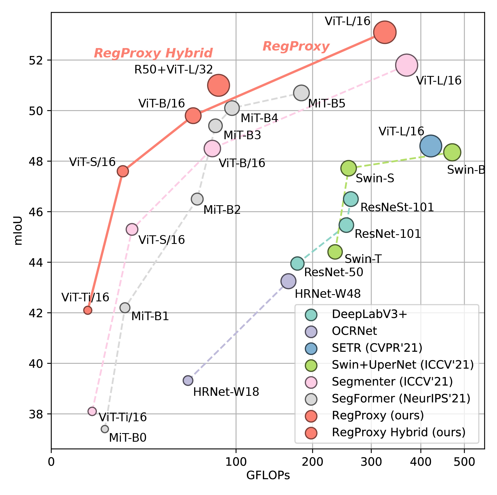

# RegionProxy

<div align="center">
  
</div>
<p align="center">
    <b>Figure 2.</b> Performance vs. GFLOPs on ADE20K val split.
</p>

**Semantic Segmentation by Early Region Proxy**

*Yifan Zhang, [Bo Pang](https://bopang1996.github.io/), [Cewu Lu](https://mvig.sjtu.edu.cn/)*

CVPR 2022 (Poster)

## Installation

1. Install PyTorch 1.7.1 and torchvision 0.8.2 following the [official guide](https://pytorch.org/get-started/locally/).

2. Install timm 0.4.12 and einops:

   ```
   pip install timm==0.4.12 einops
   ```

3. This project depends on mmsegmentation 0.17 and mmcv 1.3.13, so you may follow its instructions to [setup environment](https://github.com/open-mmlab/mmsegmentation/blob/master/docs/en/get_started.md) and [prepare datasets](https://github.com/open-mmlab/mmsegmentation/blob/master/docs/en/dataset_prepare.md).

## Models

### ADE20K

| backbone     | Resolution | FLOPs | #params. | mIoU | mIoU (ms+flip) | FPS  | download                                                     |
| ------------ | ---------- | ----- | -------- | ---- | -------------- | ---- | ------------------------------------------------------------ |
| ViT-Ti/16    | 512x512    | 3.9G  | 5.8M     | 42.1 | 43.1           | 38.9 | [[model]](https://drive.google.com/file/d/1sq3g3JcQ2NSJch-MvlvvnHFFeN-MU_DE/view?usp=sharing) |
| ViT-S/16     | 512x512    | 15G   | 22M      | 47.6 | 48.5           | 32.1 | [[model]](https://drive.google.com/file/d/1pJD4-xRiVj36SplzNhonIuNHd82A05GX/view?usp=sharing) |
| R26+ViT-S/32 | 512x512    | 16G   | 36M      | 47.8 | 49.1           | 28.5 | [[model]](https://drive.google.com/file/d/1n51emyE6EWAuoBq_P8cViFtNmf9dDxzV/view?usp=sharing) |
| ViT-B/16     | 512x512    | 59G   | 87M      | 49.8 | 50.5           | 20.1 | [[model]](https://drive.google.com/file/d/1PMVQv8cvaZmV16ARdbuQSv6-3DDeLXPy/view?usp=sharing) |
| R50+ViT-L/32 | 512x512    | 82G   | 323M     | 51.0 | 51.7           | 12.7 | [[model]](https://drive.google.com/file/d/1Kk0ABYbMOwvomrU4FaDl4Ban2XBhcxjU/view?usp=sharing) |
| ViT-L/16     | 640x640    | 326G  | 306M     | 52.9 | 53.4           | 6.6  | [[model]](https://drive.google.com/file/d/1t6Un6m-1xdoir33TG7IAiilaLamgioFZ/view?usp=sharing) |

### Cityscapes

| backbone  | Resolution | FLOPs | #params. | mIoU | mIoU (ms+flip) | download                                                     |
| --------- | ---------- | ----- | -------- | ---- | -------------- | ------------------------------------------------------------ |
| ViT-Ti/16 | 768x768    | 69G   | 6M       | 76.5 | 77.7           | [[model]](https://drive.google.com/file/d/1N4Ef8kfMeAGhcI3JLoPGd_XfBBArdF8Y/view?usp=sharing) |
| ViT-S/16  | 768x768    | 270G  | 23M      | 79.8 | 81.5           | [[model]](https://drive.google.com/file/d/11GBWhCVAXEAO_iS_MFEecndK_IF2ik4Y/view?usp=sharing) |
| ViT-B/16  | 768x768    | 1064G | 88M      | 81.0 | 82.2           | [[model]](https://drive.google.com/file/d/10yTMd5j6xoPYcVSMzhkL5S_Hh9JQ4b64/view?usp=sharing) |
| ViT-L/16  | 768x768    | -     | 307M     | 81.4 | 82.7           | [[model]](https://drive.google.com/file/d/1EBfO9M8ZYB_Eye4WpHqMs9v2WrRzbORI/view?usp=sharing) |

## Evaluation

You may evaluate the model on single GPU by running:

```bash
python test.py \
	--config configs/regproxy_ade20k/regproxy-t16-sub4+implicit-mid-4+512x512+160k+adamw-poly+ade20k.py \
	--checkpoint /path/to/ckpt \
	--eval mIoU
```

To evaluate on multiple GPUs, run:

```bash
python -m torch.distributed.launch --nproc_per_node 8 test.py \
	--launcher pytorch \
	--config configs/regproxy_ade20k/regproxy-t16-sub4+implicit-mid-4+512x512+160k+adamw-poly+ade20k.py \
	--checkpoint /path/to/ckpt 
	--eval mIoU
```

You may add `--aug-test` to enable multi-scale + flip evaluation. The `test.py` script is mostly copy-pasted from mmsegmentation. Please refer to [this](https://github.com/open-mmlab/mmsegmentation/blob/master/docs/en/inference.md) link for more usage (e.g., visualization).

## Training

The first step is to prepare the pre-trained weights. Following [Segmenter](https://github.com/rstrudel/segmenter), we use [AugReg](https://github.com/google-research/vision_transformer#available-vit-models) pre-trained weights on our tiny, small and large models, and we use [DeiT](https://github.com/facebookresearch/deit) pre-trained weights on our base models. Do following steps to prepare the pre-trained weights for model initialization:

1. For DeiT weight, simply download from [this](https://dl.fbaipublicfiles.com/deit/deit_base_distilled_patch16_384-d0272ac0.pth) link. For AugReg weights, first acquire the timm-style models:

   ```python
   import timm
   m = timm.create_model('vit_tiny_patch16_384', pretrained=True)
   ```

   The full list of entries can be found [here](https://github.com/rwightman/pytorch-image-models/blob/9b2daf2a35184854d20325d6b0f69d99e607cc7d/timm/models/vision_transformer.py#L56-L106) (vanilla ViTs) and [here](https://github.com/rwightman/pytorch-image-models/blob/9b2daf2a35184854d20325d6b0f69d99e607cc7d/timm/models/vision_transformer_hybrid.py#L43-L72) (hybrid models).

2. Convert the timm models to mmsegmentation style using [this](https://github.com/open-mmlab/mmsegmentation/blob/master/tools/model_converters/vit2mmseg.py) script.

We train all models on 8 V100 GPUs. For example, to train RegProxy-Ti/16, run:

```bash
python -m torch.distributed.launch --nproc_per_node 8 train.py 
	--launcher pytorch \
	--config configs/regproxy_ade20k/regproxy-t16-sub4+implicit-mid-4+512x512+160k+adamw-poly+ade20k.py \
	--work-dir /path/to/workdir \
	--options model.pretrained=/path/to/pretrained/model
```

You may need to adjust `data.samples_per_gpu` if you plan to train on less GPUs. Please refer to [this](https://github.com/open-mmlab/mmsegmentation/blob/master/docs/en/train.md) link for more training optioins.

## Citation

```
@article{zhang2022semantic,
  title={Semantic Segmentation by Early Region Proxy},
  author={Zhang, Yifan and Pang, Bo and Lu, Cewu},
  journal={arXiv preprint arXiv:2203.14043},
  year={2022}
}
```

